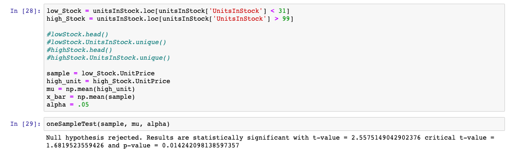
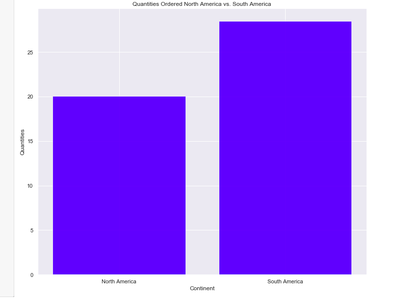

# Hypothesis tests on the Northwind database

For this project, I'll be working with the Northwind database--a free, open-source dataset created by Microsoft containing data from a fictional company. You probably remember the Northwind database from our section on Advanced SQL. Here's the schema for the Northwind database:

## Test One
### For our first question we are testing if discounts have a statistically significant effect on the number of products customers order? If so, at what level(s) of discount? I will be testing the following hypotheses at a 5% alpha level. I will be performing a one-tailed T-test to test see if the mean of quantities ordered of discounted items is higher than the mean of quantites ordered of non-discounted items. 

#### NULL HYPOTHESIS : Adding a discount to a product DOES NOT increase the average quantites ordered H0: μ = 21.72

#### ALTERNATE : Adding a discount to a product DOES increase the average quantites ordered H0: μ > 21.72

#### Significance level (alpha) : .05

The difference between discounted and non-discounted quantities is: 5.39. A positive difference indicates that there is an increase in the sample mean. Now I'll calculate the T-statistic and and compare it to the criticial-Tvalue to determine if this increase is high enough to reject the null hypothesis. In order to run this test I am assuming that my data is colleced randomly and is independent to the best of our knowledge. The assumption of a normal distribution is negligible for sample sizes > 30

Our Null hypothesis is only rejected if our T-stat is higher than the critical T-Value and our P-value is lower than the significance level, alpha

Our tests finds that 95% of the time higher quantities are ordered for items with a discount.
Now I know that there is a statistically significant increase on average of quantites ordered for discounted items. The simple effect size is denoted as the difference in means for the two distributions, which I previously found to be 5.3945. Now I will calculate Cohen's D to report the practical significance of our findings  

So our Cohen's D of .3 shows that the means of our two groups differ by .3 standard deviations. According to Cohen's threshold, this is a small effect size, that is there is a practical significance in between our two group but that difference is, well, small. However, we can conclude that adding a discount has both a statistical and practical significance on the average quantities ordered. 

Let's also use an A/B test to determine if our sample size is approprate for reports devoid of Type 1 or Type 2 errors.

Alpha = .05

Beta = .2

The sample size of 838 is well above the proposed sample size of 91.55 and therefore results are reported with a high degree of confidence. That is our results will incur type 1 errors at a maximum rate of 5% and type 2 errors at a maximum rate of 20%. My t-test finds that the null hypothesis can be rejected. Now I will address the second part of the hypothesis and calculate at which levels of discount this significance occurs.

Based on my findings above the discount levels that have statistical significance on quantity of products ordered is at the 5, 10, 15, 20, and 25%. If we judge based on difference in means, discounts at the five, fifteen, and twenty five level are pretty neck in neck. 

## Test Two: 
### For my second hypothesis test I'm interested to know if price has an effect on quantities ordered for discounted items. My instinct tells me that if an item that is priced higher is offered at a discounted rate that item will be sold at larger quantities than lower priced items offered at a discounted rate

To determine lower-priced items vs. higher priced items I'll take the median of unit price for items that are discounted. I'll then divide my group based on that number as follows

For our second hypothesis test I will be testing at an alpha level of 5%. I will run a two-sample t-test to eliminiate one of the following. This is a two tailed test.

#### NULL HYPOTHESIS: Mu Quantity (higherpriced) - Mu Quantity (lowerpriced) = 0

#### ALTERNATE HYPOTHESS: Mu Quantity (higherpriced) - Mu Quantity(lowerpriced) != 0

We failed to reject our null hypothesis, price does not have a statistical effect on Quantities sold at a discounted level. This means that the business would benefit more by applying smaller discounts to their more expensive items. This way quantites sold are increased without critically comprimising profits accrued

## Test Three:
### For our third hypothesis I've noticed that some units are in stock at much higher quantites than others. Does this have something to do with the price? I will see if higher priced items tend to be in stock in larger quantites than lower priced items. The median of units in stock will serve as the threshold for determining if an item is in "High Stock" or "Low Stock". I will use a significance level of .05 to test the following. This is a one-tailed test as we are testing if one mu is larger than the other.

#### NULL HYPOTHESIS: MU of UNIT PRICE of items in LOW STOCK < MU of UNIT PRICE of items in HIGH STOCK

#### ALTERNATIVE HYPOTHESIS: MU of UNIT PRICE of items in LOW STOCK > MU of UNIT PRICE of items in HIGH STOCK

#### Alpha: .05

Let's define items that are in High Stock to be items that are in stock of quantites of 100 or higher and low stock to be items in stock of quantites of 30 or lower

Interestingly enough, our null hypothesis is rejected, price does not have an effect on whether an item is being ordered or not. It seems that quality over quantity rules here. 

## Test Four:
### For my last hypothesis test, I'd like to see if South American countries are ordering in statistically significant larger quantities than North American countries with a significance level of .05. This is a one-tailed test as we are testing if one mu is larger than the other.

#### Null Hypothesis: North America MU > South America Mu
#### Alternative Hypothesis: North America MU < South America Mu

#### Alpha: .05

